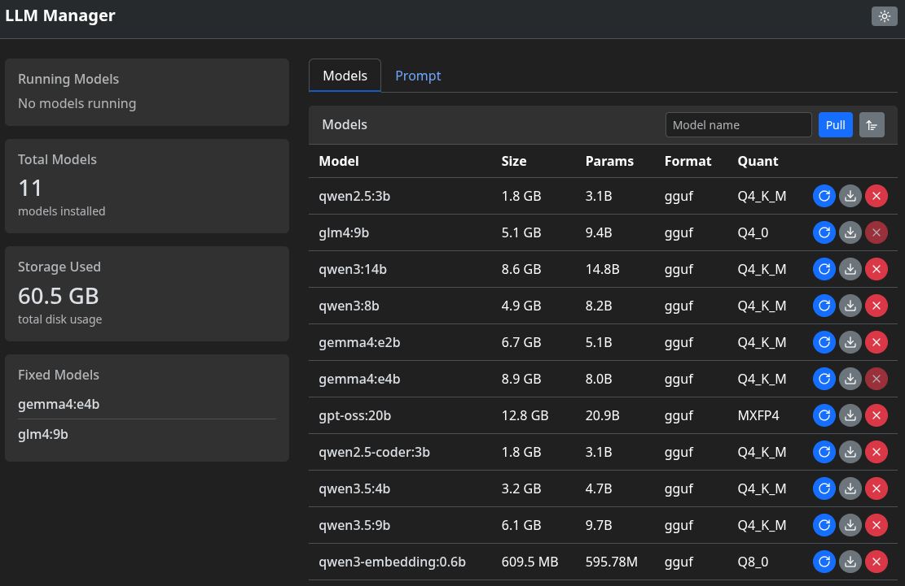

<div align="center">

# LLM Manager UI

Web UI to manage Ollama LLM server models


</div>


## Features

- View running models
- Lists all installed models
- Pull new models
- Update models (manually via update button)
- Delete old models
- Chat / Generate with any model

### Deploy
```bash
bash start.sh [options]
```
Options:
- `-h, --host HOST` - Ollama server host (default: localhost)
- `-p, --port PORT` - Ollama server port (default: 11434)
- `--help` - Show help message

The script will:
- Create a Python virtual environment (if it doesn't exist)
- Install dependencies from requirements.txt
- Start the UI server on `http://localhost:5000`

### Docker
```bash
docker-compose up -d --build
```
- Change ENV in `docker-compose.yaml` if needed.
- `OLLAMA_URL` - URL of the Ollama server (default: `http://localhost:11434`)
- `LOG_LEVEL` - Logging verbosity (default: `INFO`)
  - Options: `DEBUG`, `INFO`, `WARNING`, `ERROR`, `CRITICAL`
  - `INFO` recommended for production (shows important operations without noise)
  - `DEBUG` for troubleshooting (shows all operations including frequent fetches)

**Access the UI** at `http://localhost:5000`

## Contribution

Feel free to open issues or submit pull requests.
